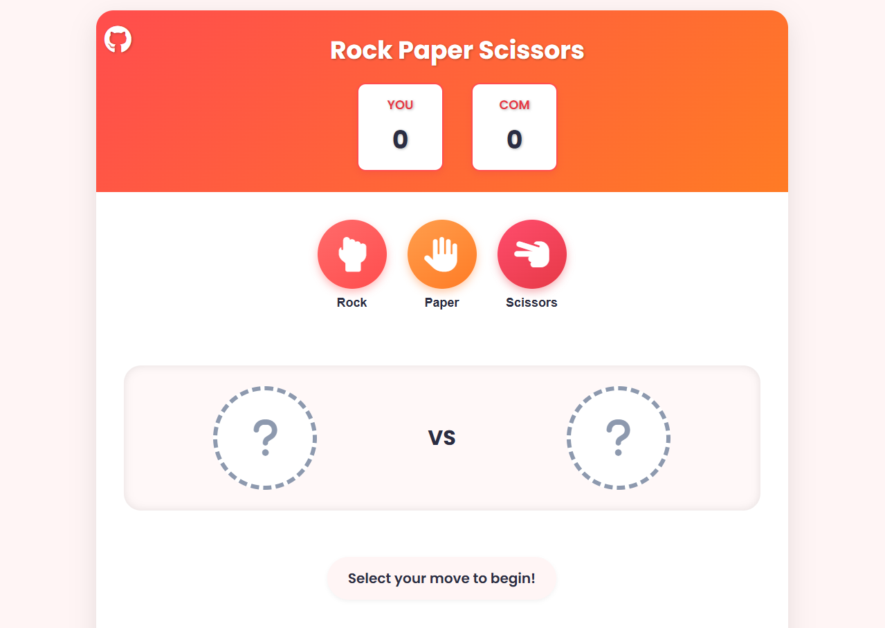

# 🪨📄✂️ Rock Paper Scissors Game



A modern, interactive Rock Paper Scissors game with sleek UI animations and score tracking. First to 5 points wins!

## ✨ Features

- **Interactive Gameplay**: Choose between rock, paper, or scissors
- **Score Tracking**: Real-time score display for player and computer
- **Animated Battles**: Visual representation of each round's choices
- **Responsive Design**: Works on all device sizes
- **Theme System**: Ready for multiple color themes (red-orange included)
- **Win/Lose Modal**: Beautiful victory/defeat screens with animations

## 🎮 How to Play

1. Click your choice (rock, paper, or scissors)
2. Computer makes a random selection
3. Winner gets a point (tie = no points)
4. First to 5 points wins the game
5. Click "Reset Game" to start over

## 🛠 Technologies Used

| Frontend       | Styling          | Icons            |
|----------------|------------------|------------------|
| HTML5          | CSS3 Animations  | Font Awesome 6   |
| JavaScript ES6 | Flexbox/Grid     | Google Fonts     |
| DOM API        | CSS Variables    |                  |

## 🚀 Quick Start

1. Clone the repository:
   ```bash
   https://github.com/rn-swain/Rock-Paper-Scissors.git
